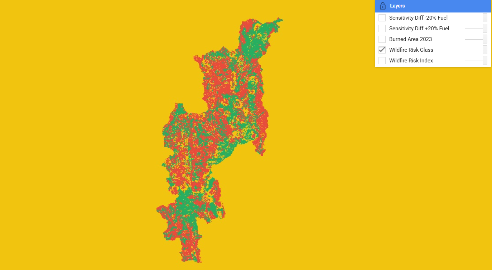
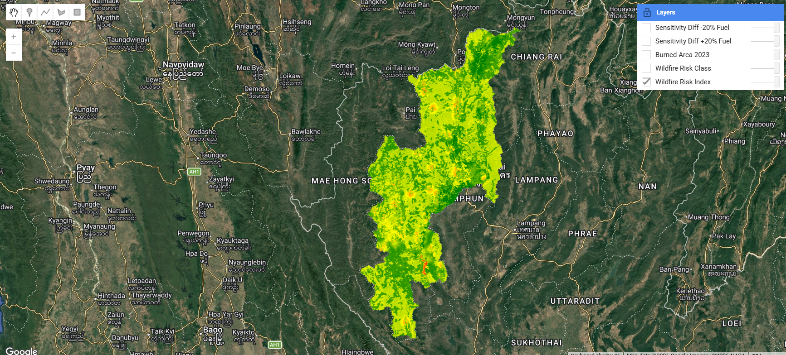
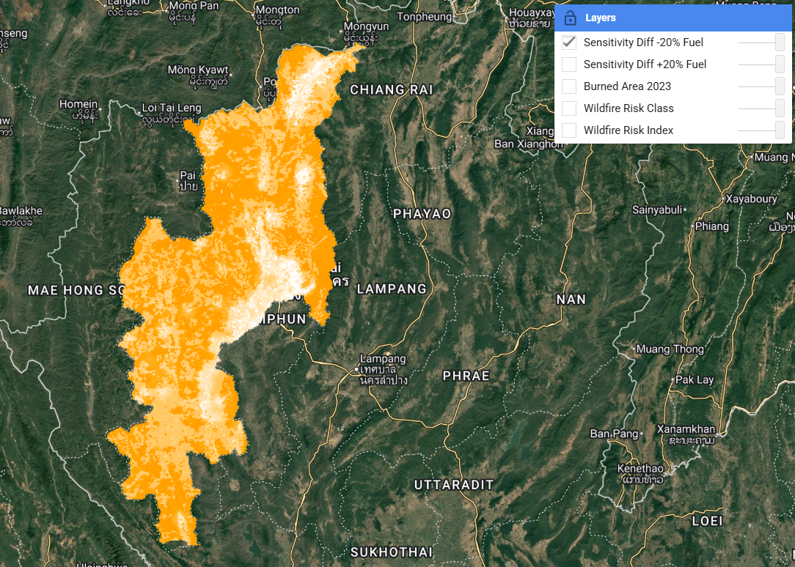
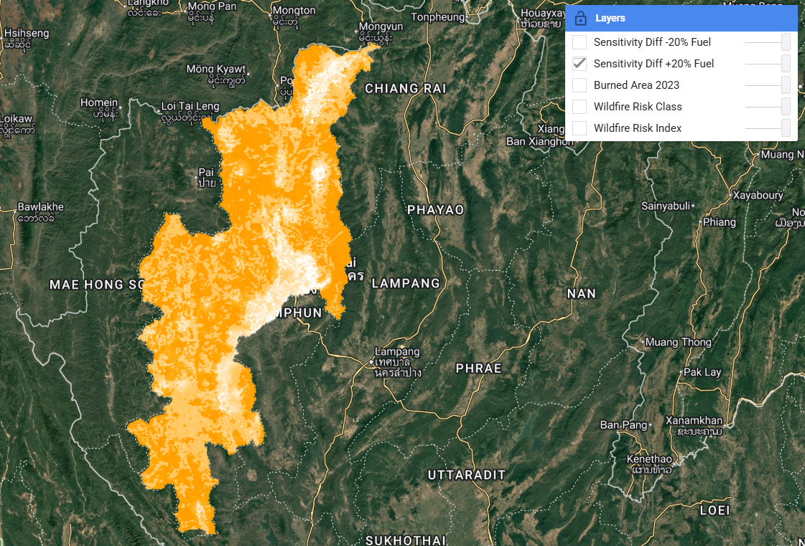
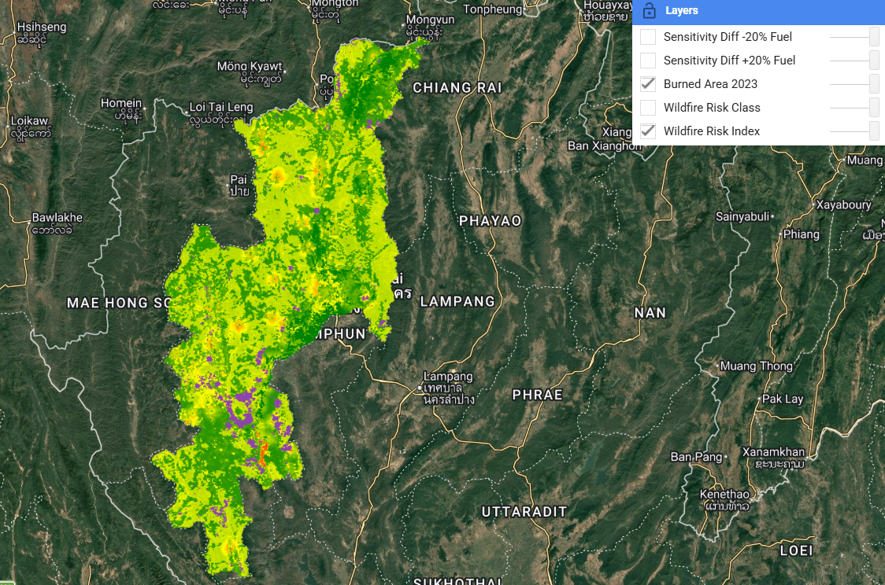

# Lab 4: การวิเคราะห์ความเสี่ยงไฟป่า จังหวัดเชียงใหม่

## ภาพรวม
งานวิจัยนี้มีวัตถุประสงค์เพื่อประเมินความเสี่ยงของการเกิดไฟป่าในจังหวัดเชียงใหม่ โดยใช้เทคนิค Multi-Criteria Spatial Analysis ผ่าน Google Earth Engine

---

## วิธีดำเนินการ (Methodology)

### ปัจจัยที่ใช้
1. เชื้อเพลิงจากการใช้ที่ดิน (Fuel)
2. ความแห้งของพืชพรรณ (NDVI)
3. ความใกล้พื้นที่ชุมชน (Human factor)
4. ความลาดชัน (Slope)

### การ Normalize
ข้อมูลทุกปัจจัยถูกปรับให้อยู่ในช่วง 0–1 เพื่อให้สามารถนำมาเปรียบเทียบและรวมกันได้

### สมการโมเดล
Risk = (Fuel × 0.40) + (Dryness × 0.30) + (Human × 0.20) + (Slope × 0.10)

### การจัดระดับความเสี่ยง
ใช้ค่าเฉลี่ยและส่วนเบี่ยงเบนมาตรฐาน (mean ± 0.5 std) ในการแบ่งระดับ:
- ต่ำ
- ปานกลาง
- สูง

---

## การวิเคราะห์ความไวของโมเดล (Sensitivity Analysis)
มีการปรับค่าน้ำหนักของปัจจัย Fuel เพิ่มและลด 20%  
พบว่า พื้นที่เสี่ยงหลักยังคงเดิมในหลายบริเวณ แสดงให้เห็นว่าโมเดลมีความเสถียรในระดับหนึ่ง  
อย่างไรก็ตาม บางพื้นที่มีการเปลี่ยนแปลง แสดงว่าโมเดลยังมีความไวต่อการกำหนดน้ำหนัก

---

## การตรวจสอบความถูกต้อง (Validation)
ผลลัพธ์ของโมเดลถูกเปรียบเทียบกับข้อมูลพื้นที่ไฟไหม้จริง (MODIS Burned Area)

พบว่า:
- พื้นที่ที่มีความเสี่ยงสูงมีความสอดคล้องกับพื้นที่ที่เกิดไฟจริงในหลายจุด
- แสดงให้เห็นว่าโมเดลสามารถสะท้อนรูปแบบการเกิดไฟป่าได้ในระดับหนึ่ง

---

## สิ่งที่ค้นพบ (Key Findings)
- พื้นที่เสี่ยงไฟป่าสูงมักอยู่ในพื้นที่ป่าและพื้นที่ที่มี NDVI ต่ำ
- พื้นที่ใกล้ชุมชนมีความเสี่ยงเพิ่มขึ้นจากกิจกรรมมนุษย์
- ความลาดชันมีผลต่อการลุกลามของไฟ

---

## ข้อจำกัดของงาน (Limitations)
- NDVI ไม่สามารถแทนความชื้นของเชื้อเพลิงได้ทั้งหมด
- ไม่มีข้อมูลลมและอุณหภูมิ
- การแทนกิจกรรมมนุษย์ยังเป็นแบบง่าย

---

## สรุป
โมเดลนี้สามารถใช้เป็นแนวทางเบื้องต้นในการประเมินความเสี่ยงไฟป่าได้  
แม้ว่ายังมีข้อจำกัด แต่สามารถพัฒนาเพิ่มเติมได้ในอนาคต

## ผลลัพธ์ของโมเดล (Results)

### แผนที่ระดับความเสี่ยงไฟป่า (Wildfire Risk Classification)

แผนที่นี้แสดงการจำแนกระดับความเสี่ยงไฟป่าในจังหวัดเชียงใหม่ โดยแบ่งออกเป็น 3 ระดับ ได้แก่ ความเสี่ยงต่ำ (สีเขียว), ปานกลาง (สีเหลือง) และสูง (สีแดง)  
จากผลลัพธ์พบว่า พื้นที่เสี่ยงสูงมีการกระจายตัวในหลายบริเวณ โดยเฉพาะพื้นที่ป่าและพื้นที่ภูเขา ซึ่งมีความเกี่ยวข้องกับปัจจัยด้านเชื้อเพลิงและความแห้งของพืชพรรณ

---

###  แผนที่ดัชนีความเสี่ยงไฟป่า (Wildfire Risk Index)

แผนที่นี้แสดงค่าดัชนีความเสี่ยงไฟป่าในรูปแบบค่าต่อเนื่อง (continuous) โดยสีเขียวแสดงถึงความเสี่ยงต่ำ และสีแดงแสดงถึงความเสี่ยงสูง  
แผนที่นี้ช่วยให้สามารถเห็นความแตกต่างของระดับความเสี่ยงในเชิงพื้นที่ได้ละเอียดมากขึ้น ก่อนนำไปจัดกลุ่มเป็นระดับความเสี่ยง

---

###  การวิเคราะห์ความไวของโมเดล (-20% Fuel)

เมื่อปรับลดน้ำหนักของปัจจัยเชื้อเพลิงลง 20% พบว่าพื้นที่ความเสี่ยงโดยรวมยังคงมีรูปแบบคล้ายคลึงกับโมเดลเดิม  
แสดงให้เห็นว่าโมเดลมีความเสถียรในระดับหนึ่ง แม้ว่าจะมีการเปลี่ยนแปลงน้ำหนักของปัจจัยสำคัญ

---

###  การวิเคราะห์ความไวของโมเดล (+20% Fuel)

เมื่อเพิ่มน้ำหนักของปัจจัยเชื้อเพลิงขึ้น 20% พบว่าพื้นที่เสี่ยงมีการเปลี่ยนแปลงชัดเจนในบางบริเวณ  
โดยเฉพาะพื้นที่ที่มีพืชพรรณหนาแน่น แสดงให้เห็นว่าปัจจัยเชื้อเพลิงมีอิทธิพลต่อผลลัพธ์ของโมเดล

---

### การตรวจสอบกับข้อมูลไฟป่าจริง (Validation)

ภาพนี้แสดงการซ้อนทับระหว่างแผนที่ความเสี่ยงไฟป่ากับข้อมูลพื้นที่ที่เกิดไฟจริงในปี 2023 (แสดงด้วยสีม่วง)  
พบว่าพื้นที่ที่เกิดไฟจริงมีแนวโน้มกระจายตัวอยู่ในบริเวณที่มีค่าความเสี่ยงปานกลางถึงสูง  
แสดงให้เห็นว่าโมเดลสามารถสะท้อนแนวโน้มของการเกิดไฟป่าได้ในระดับหนึ่ง แม้จะยังมีข้อจำกัดในบางพื้นที่

---

## สรุปภาพรวม
โมเดลสามารถประเมินความเสี่ยงไฟป่าได้ในระดับที่เหมาะสม โดยผลลัพธ์มีความสอดคล้องกับข้อมูลไฟป่าจริงบางส่วน  
การวิเคราะห์ความไวแสดงให้เห็นว่าโมเดลมีความเสถียรในภาพรวม แต่ยังมีความไวต่อการเปลี่ยนแปลงของปัจจัยเชื้อเพลิง  
ดังนั้น การเลือกปัจจัยและการกำหนดน้ำหนักจึงเป็นขั้นตอนที่มีความสำคัญต่อความแม่นยำของโมเดล

*ที่มา: ผลลัพธ์จาก Google Earth Engine*

จัดทำโดย ณัฏฐณิชา ปลอดเหตุ 6506614038
